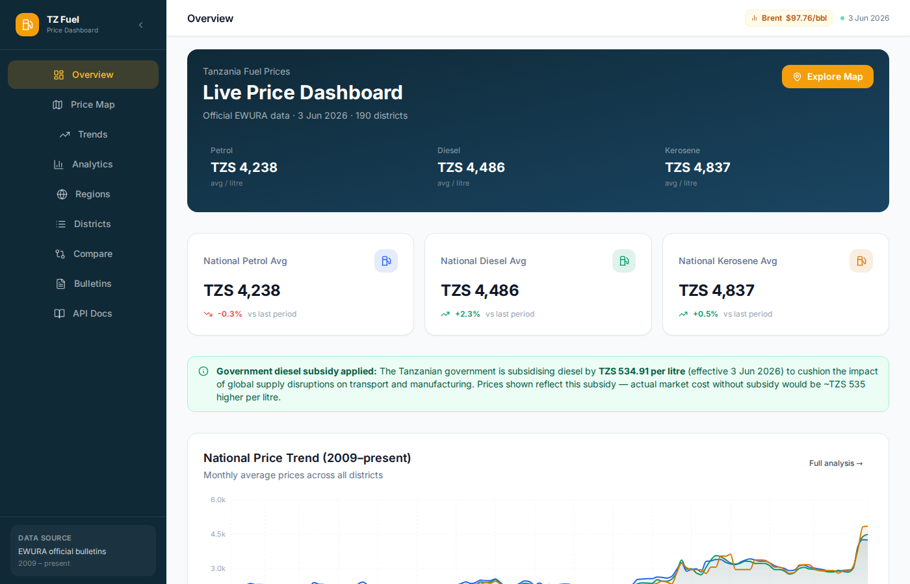
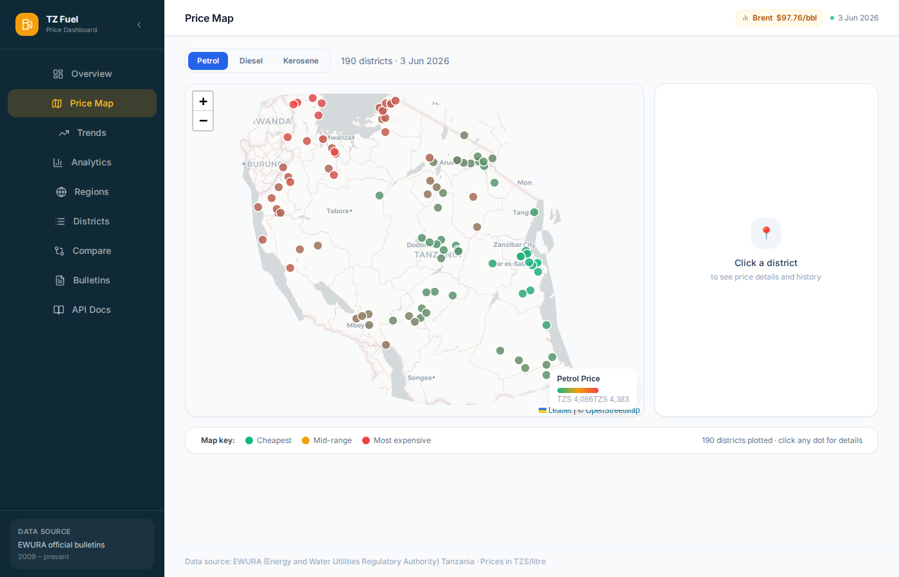
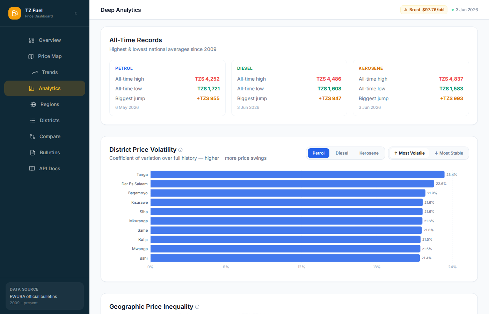
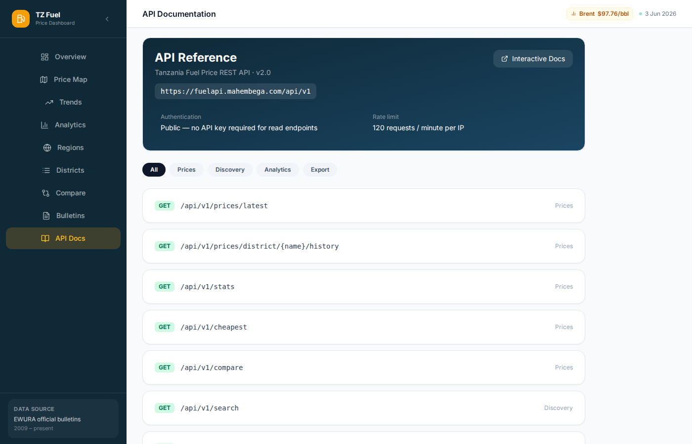
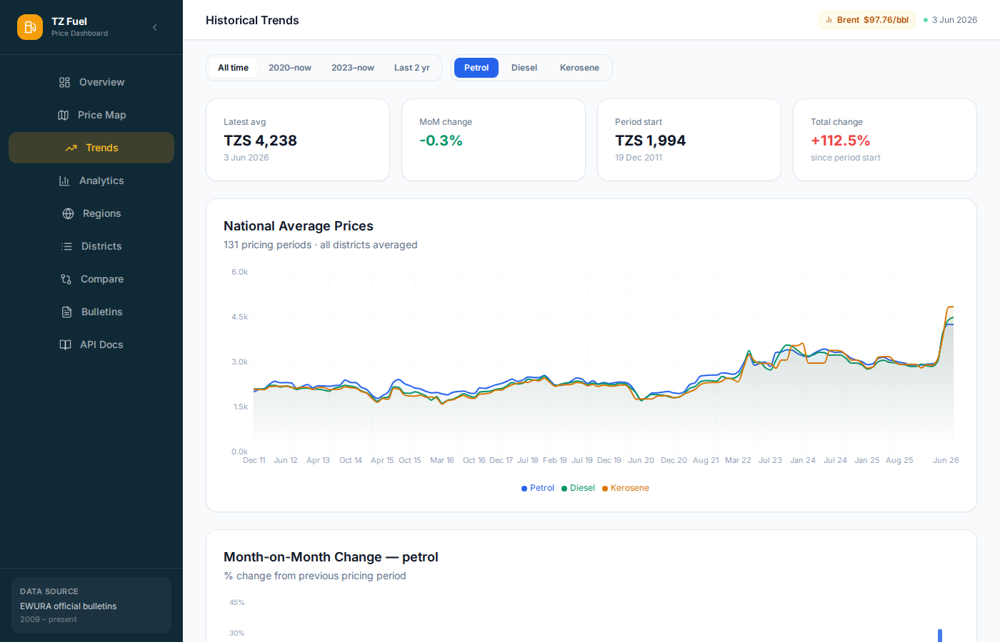
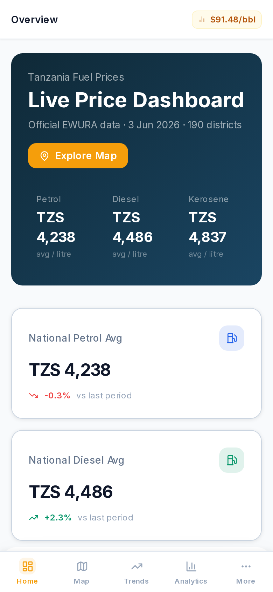

# Tanzania Fuel Price API

A production-grade REST API that scrapes **EWURA** (Energy and Water Utilities Regulatory Authority) monthly PDF bulletins and serves Tanzania's official fuel cap prices as clean, structured data — covering petrol, diesel, and kerosene across all mainland and Zanzibar districts since 2009.

Live at **[fuelapi.mahembega.com](https://fuelapi.mahembega.com)**  
Dashboard at **[fuel.mahembega.com](https://fuel.mahembega.com)**

---

## Screenshots

| Overview | Price Map |
|---|---|
|  |  |

| Deep Analytics | EWURA Bulletins |
|---|---|
|  |  |

| Historical Trends | Mobile |
|---|---|
|  |  |

---

## Features

- **19,900+ fuel price records** from 131 pricing periods (2009–present)
- **190 districts** across mainland Tanzania and Zanzibar
- **Monthly PDF scraping** from EWURA's official website
- **Automated scheduling** — new prices fetched on the 6th of each month
- **Multi-model forecasting** — auto-selects best model (Holt-Winters ETS, ARIMA, SARIMA, SARIMAX-X with oil cost in TZS)
- **Brent crude integration** — 200+ months of oil price history via EIA API
- **TZS/USD exchange rate history** — full rate history back to 1960, auto-synced monthly; used as a combined exogenous variable (`brent × TZS/USD`) in SARIMAX-X
- **PDF hosting** — bulletins stored and served locally; no EWURA URL dependency for end users
- **8 analytics endpoints** — volatility, inflation, regional gap, correlation, forecast, peak records, exchange rate
- Rate-limited, cached, and production-ready

---

## API Endpoints

### Core

| Method | Path | Description |
|---|---|---|
| `GET` | `/api/v1/prices/latest` | Latest fuel prices for all districts |
| `GET` | `/api/v1/prices/district/{name}/history` | Full price history for one district |
| `GET` | `/api/v1/stats` | National averages (min/max/cheapest/dearest) |
| `GET` | `/api/v1/search` | Search districts by name |
| `GET` | `/api/v1/compare` | Side-by-side comparison (up to 3 districts) |
| `GET` | `/api/v1/cheapest` | Cheapest districts for a fuel type |
| `GET` | `/api/v1/dates` | All available pricing period dates |
| `GET` | `/api/v1/export/csv` | Download full dataset as CSV |

### Analytics

| Method | Path | Description |
|---|---|---|
| `GET` | `/api/v1/analytics/trend` | National averages per period + MoM % change |
| `GET` | `/api/v1/analytics/volatility` | District price volatility ranking |
| `GET` | `/api/v1/analytics/regional-gap` | Cheapest vs most expensive spread over time |
| `GET` | `/api/v1/analytics/peak` | All-time records |
| `GET` | `/api/v1/analytics/inflation` | Cumulative price index + CAGR |
| `GET` | `/api/v1/analytics/correlation` | Pearson r between fuel types |
| `GET` | `/api/v1/analytics/forecast` | Multi-model price forecast with 95% CI |
| `GET` | `/api/v1/analytics/brent` | Brent crude oil price history |
| `GET` | `/api/v1/analytics/exchange-rate` | TZS/USD exchange rate history (1960–present) |
| `GET` | `/api/v1/analytics/regional-summary` | Per-region averages for a given date |

### Documents

| Method | Path | Description |
|---|---|---|
| `GET` | `/api/v1/documents` | List all imported EWURA PDF bulletins |
| `GET` | `/api/v1/documents/{date}/pdf` | Serve stored bulletin PDF by effective date |

Interactive API docs: **[fuelapi.mahembega.com/docs](https://fuelapi.mahembega.com/docs)**

---

## Forecasting

The `/api/v1/analytics/forecast` endpoint fits four competing models and picks the one with the lowest AIC:

| Model | Description |
|---|---|
| **Holt-Winters (ETS)** | Exponential smoothing with damped trend — captures level, trend, and structural drift |
| **ARIMA(1,1,1)** | Classic differenced autoregressive model |
| **SARIMA(1,1,1)(1,0,0,12)** | ARIMA with 12-month seasonal component |
| **SARIMAX-X (oil cost in TZS)** | SARIMA with `brent_usd × tzs_per_usd` as the exogenous variable — the direct TZS cost of a barrel of crude |

As of June 2026, **Holt-Winters ETS wins decisively** (AIC 386 vs 473+ for all others, R² 0.84–0.89). It captures Tanzania's structural pattern: TZS fuel prices rise persistently because of a combination of Brent movements, TZS depreciation, taxes, and regulatory lag — none of which a single exogenous variable can fully model. Holt-Winters learns this drift implicitly from the price history itself.

SARIMAX-X is evaluated every call using the combined `brent × TZS/USD` oil cost variable (a significant upgrade over Brent alone — it directly represents what a barrel costs EWURA in shillings). It still trails Holt-Winters because EWURA pricing also reflects excise duty, road levy, distribution margins, and political price freezes that no exogenous variable captures.

> For best results, register a free EIA API key at [eia.gov/opendata](https://www.eia.gov/opendata/) and set `EIA_API_KEY` in your environment.

---

## Quick Start

### Local development (SQLite, zero config)

```bash
git clone https://github.com/jhembe/tz-fuel-api.git && cd tz-fuel-api
python3 -m venv venv && source venv/bin/activate
pip install -r requirements.txt
cp .env.example .env          # set ADMIN_SECRET_KEY at minimum
export $(grep -v '^#' .env | grep -v '^$' | xargs)
venv/bin/uvicorn main:app --host 127.0.0.1 --port 8888 --reload
# → http://127.0.0.1:8888/docs
```

### Docker

```bash
ADMIN_SECRET_KEY=mysecret docker compose up --build
```

### Trigger initial data import

```bash
# Latest bulletin only:
curl -X POST http://localhost:8888/api/v1/admin/trigger-sync \
     -H "X-API-KEY: your_admin_key"

# Full historical backfill (2009–present, ~10 min):
curl -X POST http://localhost:8888/api/v1/admin/backfill \
     -H "X-API-KEY: your_admin_key"
```

---

## Environment Variables

| Variable | Default | Description |
|---|---|---|
| `DATABASE_URL` | `sqlite:///./tanzania_fuel.db` | PostgreSQL or SQLite connection string |
| `ADMIN_SECRET_KEY` | *(empty — disables admin endpoints)* | Secret for admin/sync endpoints |
| `EIA_API_KEY` | `DEMO_KEY` | EIA API key for Brent crude prices |
| `FRED_API_KEY` | *(empty)* | Optional — FRED API key for TZS/USD data; falls back to World Bank + open.er-api.com |
| `PDF_STORAGE_DIR` | `/data/pdfs` | Directory to store downloaded EWURA PDFs |
| `RATE_LIMIT_PER_MINUTE` | `120` | Per-IP request cap |
| `CACHE_TTL_SECONDS` | `300` | In-process cache TTL |

---

## Stack

- **FastAPI** — web framework
- **SQLAlchemy** + **PostgreSQL** (or SQLite for local dev)
- **pdfplumber** — PDF table extraction from EWURA bulletins
- **statsmodels** — Holt-Winters ETS, ARIMA, SARIMA, SARIMAX
- **APScheduler** — automated monthly cron-style sync jobs
- **Docker Compose** — containerised deployment

---

## Data Source

All fuel prices are sourced from **EWURA** (Energy and Water Utilities Regulatory Authority), Tanzania's official energy regulator. Prices represent the official **maximum retail cap prices** set each month for petrol, diesel, and kerosene.

[ewura.go.tz](https://www.ewura.go.tz)

---

## License

MIT
